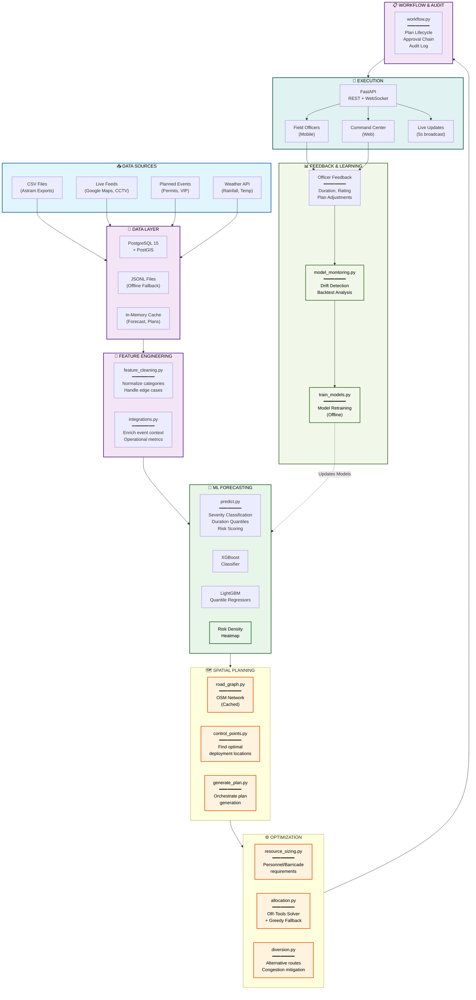
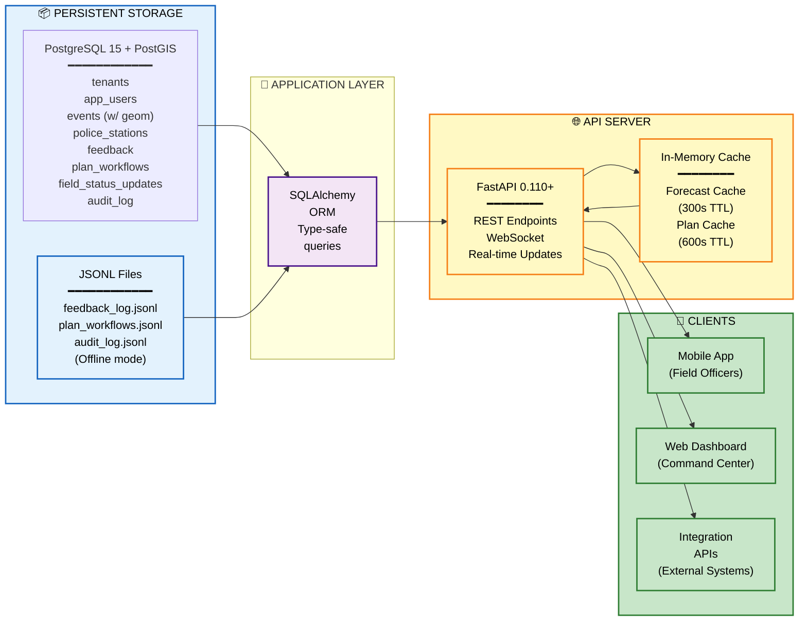
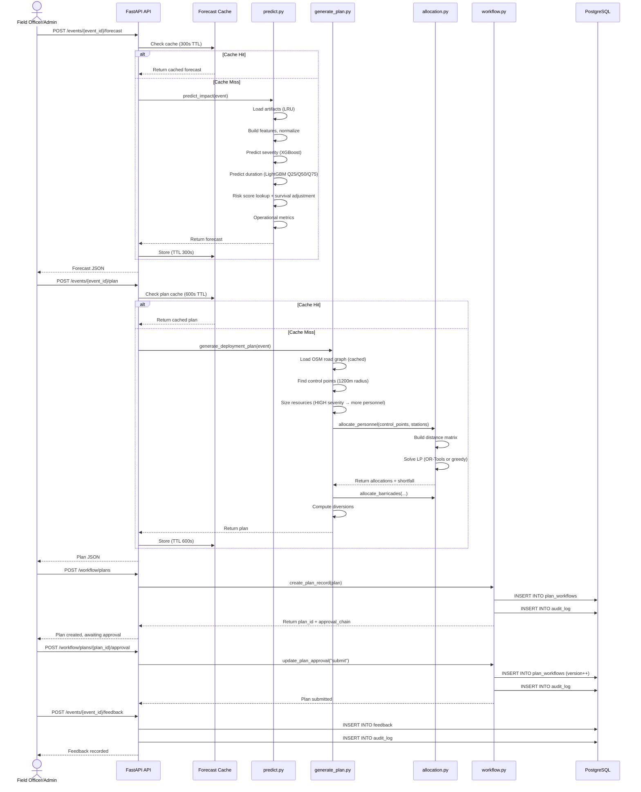

# TrafficGuide Architecture Documentation

## 🎯 Project Overview

**TrafficGuide** is an event-driven traffic congestion forecasting and resource optimization system designed for Bengaluru's traffic management. This MVP focuses on the **data layer and prediction/planning pipeline**, enabling rapid incident response with data-driven resource deployment.

### Key Capabilities

1. **Real-time Impact Prediction**: ML models predict incident severity and duration within seconds
2. **Intelligent Deployment Planning**: Automatically identifies optimal control points and allocates personnel/barricades
3. **Multi-Incident Coordination**: Manages multiple concurrent incidents holistically
4. **Feedback Loop**: Officers report outcomes → system learns and improves
5. **Multi-tenancy Ready**: Same codebase can serve multiple cities
6. **Graceful Degradation**: System remains operational even if components fail

---

## 👥 Team

| Member | Role | Responsibility |
|--------|------|-----------------|
| **Yash Sonalekar** | Lead Developer | Backend architecture, ML integration, API design |
| **Nishant Gawande** | Full-Stack Engineer | Database optimization, data pipeline |
| **Ayush Shevde** | Data/ML Engineer | ML model development, feature engineering |

---

## 🔗 Live Links

| Resource | Link | Status |
|----------|------|--------|
| **API Server** | `http://localhost:8000` | 🚀 Development |
| **API Documentation (Swagger)** | `http://localhost:8000/docs` | 📚 Available |
| **Alternative Docs (ReDoc)** | `http://localhost:8000/redoc` | 📚 Available |
| **WebSocket Live Feed** | `ws://localhost:8000/ws/live` | 📡 Real-time |
| **GitHub Repository** | [TrafficGuide](https://github.com) | 🔗 Main Branch |

> **Note**: Update these links based on your actual deployment environment (staging/production)

---

## 🏗️ System Architecture



---

## 💾 Data Architecture



**Database Schema Overview**:

| Table | Purpose | Key Fields |
|-------|---------|-----------|
| `events` | Core incident records with geospatial geometry | id, latitude, longitude, geom (PostGIS Point), event_cause, corridor, zone, status, duration_minutes |
| `police_stations` | Resource inventory per station | name, zone, latitude, longitude, available_personnel, available_barricades |
| `feedback` | Officer feedback on forecasts and plans | event_id, predicted_severity, actual_duration_minutes, officer_rating, plan_accepted, plan_json |
| `plan_workflows` | Plan lifecycle and approval chain | plan_id, event_id, status, version, approval_chain (JSON), plan_json |
| `audit_log` | Immutable compliance log | audit_id, action, actor, resource_type, resource_id, details (JSON) |
| `field_status_updates` | Real-time field officer status | event_id, control_point_node_id, status, latitude, longitude, photo_url, note |

---

## 🤖 ML Pipeline Architecture

```mermaid
graph LR
    subgraph TrainingPipeline["📊 MODEL TRAINING (Offline)"]
        HistoricalData["Historical Data<br/>━━━━━<br/>Feedback Table<br/>Event History<br/>(30-day window)"]
        
        DataProcessing["Data Processing<br/>━━━━━<br/>Normalize features<br/>Handle censoring<br/>Feature engineering"]
        
        FeatureEngineering["Feature Matrix<br/>━━━━━<br/>hour_of_day<br/>day_of_week<br/>event_cause<br/>corridor<br/>zone<br/>police_station"]
        
        TrainSeverity["Train Severity<br/>Classifier<br/>━━━━━<br/>XGBoost<br/>Pipeline"]
        
        TrainDuration["Train Duration<br/>Regressors<br/>━━━━━<br/>LightGBM<br/>Quantiles:<br/>Q25, Q50, Q75"]
        
        TrainRisk["Compute Risk<br/>Density<br/>━━━━━<br/>Corridor × Hour<br/>× Day_of_Week"]
        
        ArtifactOutput["Output Artifacts<br/>━━━━━━━━<br/>severity_model.pkl<br/>duration_q*.pkl<br/>risk_density.parquet<br/>survival_table.parquet"]
    end

    subgraph InferencePipeline["⚡ INFERENCE (Online)"]
        EventInput["Event Input<br/>━━━━━<br/>Cause, Corridor<br/>Zone, Station<br/>Datetime"]
        
        LoadArtifacts["Load Artifacts<br/>━━━━━<br/>LRU Cache<br/>~100-200MB<br/>loaded once"]
        
        BuildFeatures["Build Features<br/>━━━━━<br/>Normalize categories<br/>Enrich context<br/>Add time features"]
        
        PredictSeverity["Predict Severity<br/>━━━━━<br/>P(HIGH severity)<br/>XGBoost inference<br/>(~100ms)"]
        
        PredictDuration["Predict Duration<br/>━━━━━<br/>Q25, Q50, Q75<br/>LightGBM quantile<br/>regression"]
        
        RiskLookup["Risk Score<br/>Lookup<br/>━━━━━<br/>Exact match or<br/>fallback aggregation"]
        
        SurvivalAdjust["Survival<br/>Adjustment<br/>━━━━━<br/>Correct for<br/>right-censored data"]
        
        OperMetrics["Operational<br/>Metrics<br/>━━━━━<br/>Personnel demand<br/>Expected delay<br/>Queue length<br/>Confidence"]
        
        ForecastOutput["Forecast Output<br/>━━━━━<br/>severity_label<br/>duration_CI<br/>risk_score<br/>personnel_demand"]
    end

    subgraph Monitoring["📈 MONITORING & DRIFT"]
        FeedbackCompare["Compare Predicted<br/>vs Actual<br/>━━━━━<br/>Compute error rates<br/>Aggregate by<br/>corridor/cause"]
        
        DriftDetect["Drift Detection<br/>━━━━━<br/>Error > threshold?<br/>Distribution shift?"]
        
        Retrain["Flag for<br/>Retraining<br/>━━━━━<br/>Alert ops<br/>Schedule retrain"]
    end

    %% Training flow
    HistoricalData --> DataProcessing
    DataProcessing --> FeatureEngineering
    FeatureEngineering --> TrainSeverity
    FeatureEngineering --> TrainDuration
    FeatureEngineering --> TrainRisk
    TrainSeverity --> ArtifactOutput
    TrainDuration --> ArtifactOutput
    TrainRisk --> ArtifactOutput

    %% Inference flow
    EventInput --> LoadArtifacts
    EventInput --> BuildFeatures
    LoadArtifacts --> PredictSeverity
    LoadArtifacts --> PredictDuration
    LoadArtifacts --> RiskLookup
    BuildFeatures --> PredictSeverity
    BuildFeatures --> PredictDuration
    BuildFeatures --> RiskLookup
    PredictSeverity --> SurvivalAdjust
    PredictDuration --> SurvivalAdjust
    RiskLookup --> SurvivalAdjust
    SurvivalAdjust --> OperMetrics
    OperMetrics --> ForecastOutput

    %% Monitoring flow
    ForecastOutput --> FeedbackCompare
    FeedbackCompare --> DriftDetect
    DriftDetect --> Retrain
    Retrain -.->|Triggers Offline| TrainingPipeline

    %% Styling
    classDef training fill:#c8e6c9,stroke:#2e7d32,stroke-width:2px,color:#000
    classDef inference fill:#b3e5fc,stroke:#01579b,stroke-width:2px,color:#000
    classDef monitoring fill:#ffe0b2,stroke:#e65100,stroke-width:2px,color:#000

    class TrainingPipeline,HistoricalData,DataProcessing,FeatureEngineering,TrainSeverity,TrainDuration,TrainRisk,ArtifactOutput training
    class InferencePipeline,EventInput,LoadArtifacts,BuildFeatures,PredictSeverity,PredictDuration,RiskLookup,SurvivalAdjust,OperMetrics,ForecastOutput inference
    class Monitoring,FeedbackCompare,DriftDetect,Retrain monitoring
```



**Model Artifacts**:

| Artifact | Type | Purpose | Size |
|----------|------|---------|------|
| `severity_model.pkl` | XGBoost Pipeline | Classify incidents as HIGH/LOW severity | ~10MB |
| `duration_q25_model.pkl` | LightGBM Regressor | Predict 25th percentile duration | ~8MB |
| `duration_q50_model.pkl` | LightGBM Regressor | Predict median duration | ~8MB |
| `duration_q75_model.pkl` | LightGBM Regressor | Predict 75th percentile duration | ~8MB |
| `risk_density.parquet` | Parquet DataFrame | Corridor × Hour × Day-of-Week risk heatmap | ~50MB |
| `duration_survival_table.parquet` | Parquet DataFrame | Censoring adjustments per corridor/cause | ~5MB |

---

## 📐 Data Flow: End-to-End Example



---

## 🔄 Feedback Loop & Model Retraining

```mermaid
graph LR
    subgraph OfflineCycle["🔄 OFFLINE CYCLE (24h)")
        Collect["Collect Feedback<br/>━━━━━<br/>Last 30 days<br/>of feedback<br/>records"]
        
        Analyze["Analyze Drift<br/>━━━━━<br/>Compute error<br/>rates by<br/>corridor/cause"]
        
        Decide["Decision<br/>━━━━━<br/>Error > 15%?<br/>Threshold met?"]
        
        Train["Retrain Models<br/>━━━━━<br/>Rerun training<br/>pipeline on<br/>new feedback"]
        
        Validate["Validate<br/>━━━━━<br/>Backtest on<br/>held-out data"]
        
        Deploy["Deploy<br/>Artifacts<br/>━━━━━<br/>Update<br/>models/ dir<br/>Invalidate<br/>artifact cache"]
    end

    Collect --> Analyze
    Analyze --> Decide
    Decide -->|Yes| Train
    Decide -->|No| Collect
    Train --> Validate
    Validate -->|Pass| Deploy
    Validate -->|Fail| Collect

    Deploy -.-> |Next forecast<br/>uses new models| ForecastInference["Next Forecast<br/>Request"]

    classDef feedback fill:#fff9c4,stroke:#f57f17,stroke-width:2px,color:#000
    classDef deploy fill:#c8e6c9,stroke:#2e7d32,stroke-width:2px,color:#000

    class Collect,Analyze,Decide,Train,Validate feedback
    class Deploy,ForecastInference deploy
```

---

## 📸 Screenshots & UI Reference

### API Documentation
```
Visit http://localhost:8000/docs for interactive Swagger UI
Visit http://localhost:8000/redoc for ReDoc alternative
```

**Screenshot Placeholders**:
- [ ] API Swagger interface
- [ ] Forecast response JSON example
- [ ] Plan generation with control points map
- [ ] Approval workflow UI
- [ ] Real-time WebSocket dashboard
- [ ] Field officer mobile interface
- [ ] Command center dashboard
- [ ] Feedback recording form
- [ ] Metrics and ROI dashboard
- [ ] Audit log viewer

> **To add**: Place screenshots in `docs/screenshots/` and reference them here:
> ```
> 
> ```

---

## 🎯 Key Design Decisions

| Decision | Rationale | Trade-offs |
|----------|-----------|-----------|
| **PostgreSQL + PostGIS** | Geospatial queries, multi-tenancy, ACID guarantees | Requires database setup; JSONL fallback available |
| **In-Memory Caching (300-600s TTL)** | Reduce ML re-runs; fast forecast responses | Stale data up to TTL; no distributed cache |
| **Subprocess for OR-Tools** | Prevent solver crashes from killing API | Overhead of subprocess spawning (~100ms) |
| **Greedy allocation fallback** | Works when OR-Tools unavailable | Suboptimal vs. LP solution |
| **JSONL for offline mode** | Works without database; immutable audit logs | Sequential scan slower than SQL queries |
| **Survival analysis for duration** | Corrects for right-censored historical data | Requires censoring table; adds complexity |

---

## 🚀 Quick Start Commands

```bash
# Install dependencies
pip install -r requirements.txt

# Run API server
uvicorn main:app --reload --port 8000

# Test forecast (standalone)
python predict.py

# Test plan generation (demo mode, no network)
python -m backend.optimization.generate_plan --lat 12.9716 --lon 77.5946 --demo-cache

# Load historical data into PostgreSQL
python -m backend.data.load_data path/to/events.csv

# Retrain ML models
python -m backend.ml.train_models

# Run tests
pytest tests/ -v
```

---

## 📞 Support & Contributing

- **Issues**: Report bugs in GitHub issues
- **Discussions**: Ask questions in GitHub discussions
- **PRs**: Submit pull requests for new features
- **Docs**: Update CLAUDE.md for major architectural changes

---

**Last Updated**: June 20, 2026  
**Architecture Version**: 1.0  
**Status**: Production-Ready MVP
